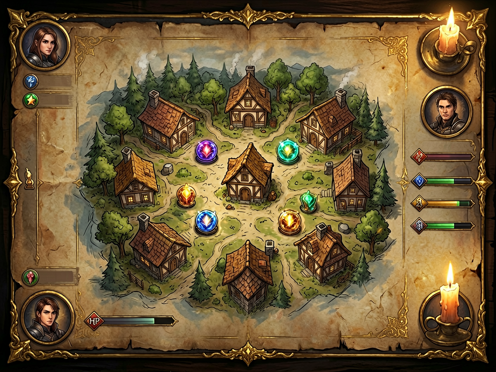
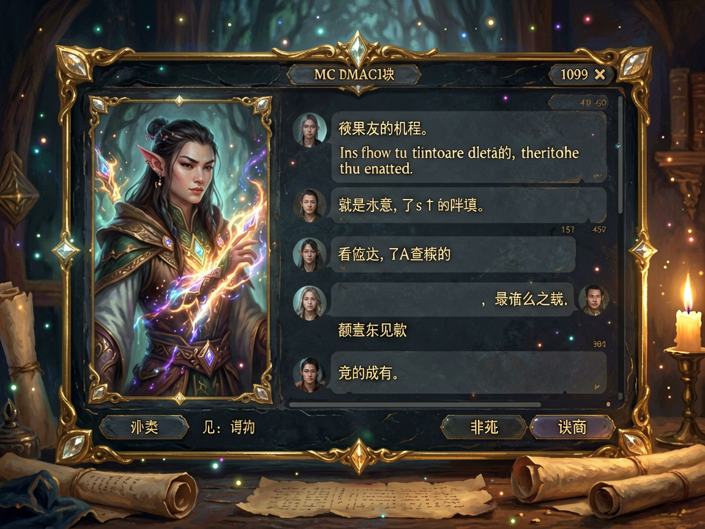
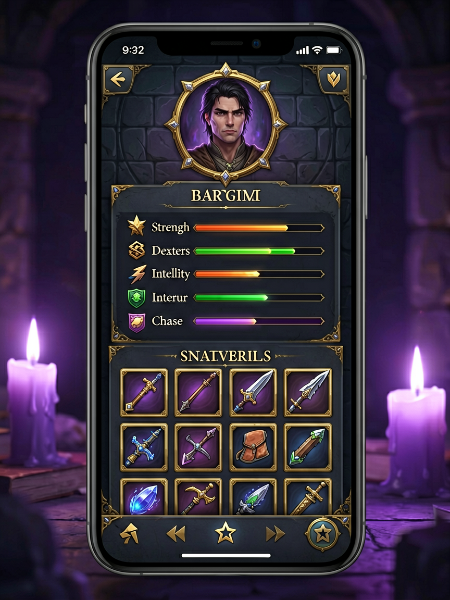

# TRPG Desk · 跑团主持人辅助器

> 基于 Web 的实时多人跑团(Tabletop RPG)辅助系统。无需安装 App — 主持人在电脑上运行,玩家手机扫码即加入。

[English](./README.md) · [简体中文](./README.zh-CN.md)

## 📸 游戏截图

<table>
  <tr>
    <td width="33%" align="center"><b>主持人版图界面</b></td>
    <td width="33%" align="center"><b>NPC AI 对话</b></td>
    <td width="33%" align="center"><b>玩家手机端</b></td>
  </tr>
  <tr>
    <td></td>
    <td></td>
    <td></td>
  </tr>
</table>

## ✨ 功能特性

- **实时多人版图与棋子系统** — 主持人上传版图背景、拖动放置 NPC/线索/事件标记,玩家棋子在大屏实时同步移动;支持回合制管理、HP 显示、地图标记定位。
- **AI 驱动的 NPC 对话与图片生成** — 主持人一键生成版图背景、NPC 立绘、物品图标;NPC 支持多轮 AI 对话(含性格、记忆、开场白、目的设定)。支持 Agnes AI 或任意 OpenAI 兼容 API。
- **NPC 商店 + 线索卡 + 背包系统** — 主持人为 NPC 配置商品(金币🪙+库存📦),玩家手机端实时同步商店并购买;线索卡可推送到指定玩家背包。
- **跨平台、零安装** — 纯浏览器访问。主持人电脑 + 玩家手机 + 大屏平板/电视,只需同一 Wi-Fi。
- **中英双语** — 访问 `/` 为中文,访问 `/en` 为英文。同一房间内玩家可使用不同语言。

## 🚀 快速开始

### 方式 A:一键运行包(推荐非开发者使用)

根据系统下载最新发布包:

- **Windows**:`trpg-desk-v2.4.51-windows.zip` → 解压 → 双击 `start.bat`
- **macOS**:`trpg-desk-v2.4.51-mac.tar.gz` → 解压 → 双击 `start.command`

环境要求:
- Windows:已安装 Node.js 18+([下载地址](https://nodejs.org/))
- macOS:已安装 Node.js 18+(`brew install node`)

启动脚本会自动完成:
1. 安装 npm 依赖
2. 在 3000 端口启动服务器
3. 自动打开浏览器访问 http://localhost:3000/

### 方式 B:从源码运行

```bash
git clone https://github.com/<your-username>/trpg-desk.git
cd trpg-desk
npm install
npm start
```

浏览器打开 http://localhost:3000/

## 🎲 使用流程

1. **主持人**:在电脑打开网址,选择"主持人"角色。用控制台上传版图、放置 NPC、管理回合。
2. **玩家**:用手机扫描主持人屏幕上的二维码,或访问局域网网址。选择一个玩家位置进入。
3. **大屏(可选)**:在平板/电视打开网址,选择"Pad 桌面"。展示公共版图,实时同步棋子移动。

## 🔧 AI 功能配置

复制 `config.example.json` 为 `config.json` 并编辑:

```json
{
  "agnesApiKey": "sk-你的-agnes-api-key",
  "customApi": {
    "enabled": false,
    "baseUrl": "https://api.openai.com",
    "apiKey": "sk-your-openai-key",
    "textModel": "gpt-4o-mini",
    "imageModel": "dall-e-3",
    "imageSize": "1024x1024"
  }
}
```

- **默认**:使用 [Agnes AI](https://agnes-ai.com)(`agnes-2.0-flash` 文本 / `agnes-image-2.1-flash` 图片)。
- **自定义 API**:设置 `customApi.enabled: true`,填入 OpenAI / Deepseek / 通义千问等任意 OpenAI 兼容 API。
- **优先级**:环境变量 `AGNES_API_KEY` > `config.json` > `config.example.json`。

## 🌍 中英双语支持

| URL | 语言 |
| --- | --- |
| `http://localhost:3000/` | 简体中文 |
| `http://localhost:3000/en` | English |

**游戏内切换**:点击右上角 🌐 按钮可随时切换语言,无需重启游戏。

同一房间内的玩家可以各自选择语言,两个版本共用同一套后端、Socket、数据。

## 📦 部署方式

除了一键包,还支持:

- **PM2 守护进程**:`pm2 start ecosystem.config.js`
- **Docker**:`docker-compose up -d`
- **Nginx 反向代理**:转发到 3000 端口

详见 `DEPLOY.md`。

## 🛠️ 技术栈

- **后端**:Node.js + Express + Socket.IO + Multer
- **前端**:原生 JavaScript + WebSocket + Web Speech API
- **AI**:Agnes AI 或任意 OpenAI 兼容 API
- **实时同步**:Socket.IO(单房间模型)

## 📁 项目结构

```
trpg-desk/
├── server.js              # Express + Socket.IO 服务端
├── public/
│   ├── index.html         # 中文版界面
│   ├── client.js          # 中文版客户端逻辑
│   ├── style.css          # 共享样式
│   └── en/
│       ├── index.html     # 英文版界面
│       └── client.js       # 英文版客户端逻辑
├── config.example.json    # 配置模板
├── config.json            # (用户创建)运行时配置
├── uploads/               # AI 生成的图片和上传文件
├── ecosystem.config.js    # PM2 配置
├── Dockerfile             # Docker 镜像
└── docker-compose.yml     # Docker Compose
```

## 📜 开源协议

MIT — 自由使用、修改、分发。专为桌游店家、TRPG 社区、教育场景设计。

## 🙏 致谢

- [Agnes AI](https://agnes-ai.com) — 默认 AI 服务
- [Socket.IO](https://socket.io) — 实时通信
- 全程使用 [TRAE IDE](https://www.trae.cn/) + AI 辅助开发,经历 10+ 个版本迭代
